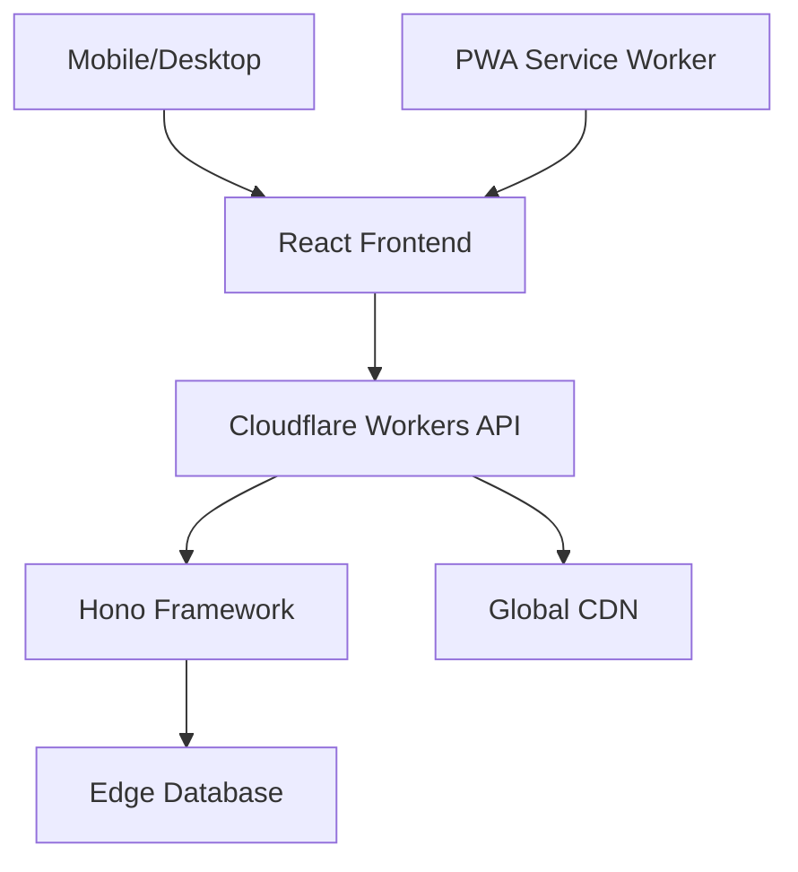

# 🎮 2048 Clash: Global Skill Arena

[](https://reactjs.org/)
[](https://workers.cloudflare.com/)
[](https://hono.dev/)
[](https://choosealicense.com/licenses/mit/)

> 🌍 **[中文文档](./README_CN.md)** | **English Documentation**

A next-generation 2048 experience powered by cutting-edge web technologies. Compete globally, track your skill progression, and master the art of strategic tile merging with real-time leaderboards and advanced analytics.

## ✨ What Makes 2048 Clash Special?

2048 Clash revolutionizes the classic puzzle game by introducing:

- **🏆 Global Competition**: Real-time skill-based leaderboards powered by Cloudflare's edge network
- **📊 Advanced Analytics**: Detailed performance metrics including efficiency scores and strategic analysis
- **⚡ Lightning Fast**: Sub-100ms response times thanks to Cloudflare Workers distributed computing
- **🌐 Multi-language Support**: Seamless localization with intelligent language detection
- **📱 Progressive Web App**: Native-like experience across all devices

## 🚀 Core Features

### 🎯 Intelligent Gameplay
- **Smart Scoring System**: Advanced algorithms evaluate strategy, not just final scores
- **Move Efficiency Tracking**: Real-time analysis of your decision-making patterns
- **Adaptive Difficulty**: Dynamic challenges based on your skill level

### 🌍 Global Ecosystem
- **Real-time Leaderboards**: Compete with players worldwide instantly
- **Country Rankings**: Represent your nation in global competitions
- **Achievement System**: Unlock milestones and showcase your expertise

### 🔧 Technical Excellence
- **Edge Computing**: Cloudflare Workers ensure minimal latency worldwide
- **Offline Support**: Play seamlessly even without internet connection
- **Data Synchronization**: Automatic cloud backup of your progress

## 🏗️ Architecture Overview



### 🛠️ Technology Stack

#### Frontend Architecture
- **React 19.1.1**: Latest features with concurrent rendering
- **Modern CSS**: CSS Grid, Flexbox, and custom properties
- **Progressive Web App**: Service workers for offline functionality
- **Responsive Design**: Mobile-first approach with touch gestures

#### Backend Infrastructure
- **Cloudflare Workers**: Serverless edge computing platform
- **Hono Framework**: Ultra-fast web framework for Workers
- **Edge Runtime**: V8 isolates for instant cold starts
- **Global Distribution**: 200+ data centers worldwide

#### Cloudflare Technologies
- **Workers**: Serverless compute at the edge
- **KV Storage**: Global key-value store for user data
- **Durable Objects**: Consistent state for real-time features
- **Analytics**: Performance monitoring and usage insights
- **CDN**: Static asset delivery optimization

## 🚀 Quick Start

### Prerequisites
- Node.js 18+ 
- npm or yarn
- Modern browser (Chrome 90+, Firefox 88+, Safari 14+)

### Installation

```bash
# Clone the repository
git clone https://github.com/yourusername/2048-clash.git

# Navigate to project directory
cd 2048-clash

# Install dependencies
npm install

# Start development server
npm start
```

### Environment Setup

```bash
# Create environment file
cp .env.example .env.local

# Configure your settings
REACT_APP_API_URL=https://your-worker.your-subdomain.workers.dev
REACT_APP_ENVIRONMENT=development
```

### Build for Production

```bash
# Create optimized production build
npm run build:prod

# Preview production build locally
npm run preview
```

## 🎮 How to Master 2048 Clash

### 🎯 Basic Gameplay
1. **Register/Login**: Create your profile to track global progress
2. **Movement**: Use arrow keys (desktop) or swipe gestures (mobile)
3. **Strategy**: Merge tiles efficiently to reach higher numbers
4. **Compete**: Climb the global leaderboards with skill-based scoring

### 📊 Skill Evaluation Metrics
- **Move Efficiency**: Moves-to-score ratio optimization
- **Time Performance**: Speed without sacrificing strategy
- **Tile Management**: Board state optimization
- **Consistency**: Performance stability across games

### 🏆 Competitive Features
- **Daily Challenges**: Unique board configurations
- **Weekly Tournaments**: Special events with exclusive rewards
- **Global Rankings**: Eternal leaderboard positions
- **Country Competitions**: National pride representation

## 🌐 Global Infrastructure

### Edge Computing Benefits
- **Sub-100ms Latency**: Responses from nearest data center
- **99.9% Uptime**: Distributed redundancy across regions
- **Auto-scaling**: Handle traffic spikes seamlessly
- **Global Consistency**: Synchronized leaderboards worldwide

### Performance Metrics
- **First Contentful Paint**: < 1.5s
- **Time to Interactive**: < 2.5s
- **Cumulative Layout Shift**: < 0.1
- **Lighthouse Score**: 95+ across all metrics

## 📱 Progressive Web App Features

- **Offline Play**: Continue gaming without internet
- **Install Prompt**: Add to home screen experience
- **Push Notifications**: Tournament alerts and achievements
- **Background Sync**: Automatic score synchronization

## 🔧 Development

### Project Structure
```
src/
├── components/          # Reusable UI components
├── pages/              # Route components
├── hooks/              # Custom React hooks
├── utils/              # Utility functions
├── services/           # API and external services
├── styles/             # Global styles and themes
└── workers/            # Cloudflare Workers code
```

### Key Files
- `src/client.js`: API client with Cloudflare Workers integration
- `src/Game2048.js`: Core game logic and state management
- `src/score.js`: Advanced scoring and analytics system
- `src/GlobalRank.js`: Real-time leaderboard component

### Available Scripts
```bash
npm start          # Development server
npm run build      # Production build
npm run build:prod # Production build with optimizations
npm test           # Run test suite
npm run analyze    # Bundle size analysis
```

## 🤝 Contributing

We welcome contributions! Please see our [Contributing Guide](./CONTRIBUTING.md) for details.

### Development Workflow
1. Fork the repository
2. Create a feature branch: `git checkout -b feature/amazing-feature`
3. Commit changes: `git commit -m 'Add amazing feature'`
4. Push to branch: `git push origin feature/amazing-feature`
5. Open a Pull Request

## 📊 Analytics & Monitoring

- **Real-time Metrics**: Player counts, game sessions, performance
- **Error Tracking**: Automatic issue detection and reporting
- **Performance Monitoring**: Core Web Vitals tracking
- **User Analytics**: Engagement patterns and feature usage

## 📜 License

This project is licensed under the MIT License - see the [LICENSE](LICENSE) file for details.

## 🙏 Acknowledgments

- **Cloudflare**: For providing the edge computing infrastructure
- **React Team**: For the amazing frontend framework
- **Hono**: For the lightweight and fast web framework
- **Community**: All contributors and players worldwide

---

<div align="center">

**Built with ❤️ using modern web technologies**

[🌐 Live Demo](https://2048-clash.pages.dev/) • [📖 Documentation](https://github.com/qianfeiqianlan/2048-clash) • [🐛 Report Bug](https://github.com/qianfeiqianlan/2048-clash/pulls) • [💡 Request Feature](https://github.com/qianfeiqianlan/2048-clash/pulls)

</div>