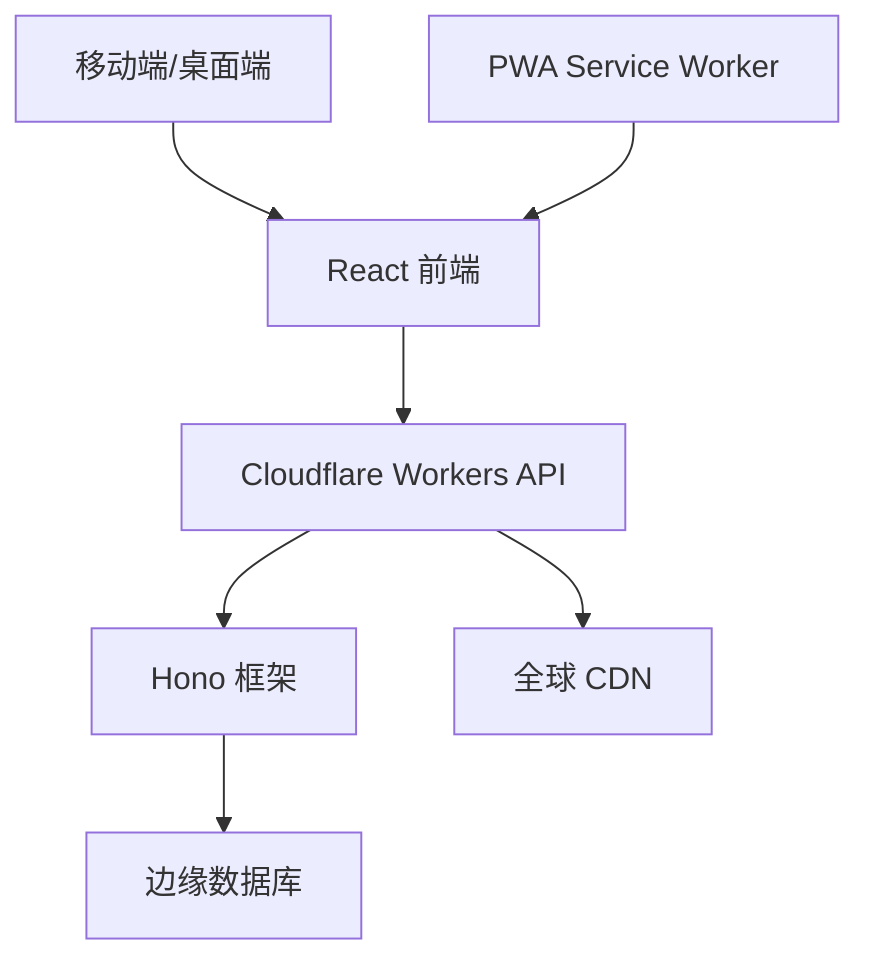

# 🎮 2048 竞技场：全球技能对决

[](https://reactjs.org/)
[](https://workers.cloudflare.com/)
[](https://hono.dev/)
[](https://choosealicense.com/licenses/mit/)

> **中文文档** | 🌍 **[English Documentation](./README.md)**

基于前沿 Web 技术打造的新一代 2048 体验。全球竞技、技能追踪，在实时排行榜和高级分析的助力下，掌握策略性方块合并的艺术。

## ✨ 2048 竞技场的独特之处

2048 竞技场通过引入以下特性革新了经典益智游戏：

- **🏆 全球竞技**: 基于 Cloudflare 边缘网络的实时技能排行榜
- **📊 高级分析**: 详细的性能指标，包括效率评分和策略分析
- **⚡ 极速响应**: 借助 Cloudflare Workers 分布式计算实现亚 100 毫秒响应
- **🌐 多语言支持**: 智能语言检测的无缝本地化
- **📱 渐进式 Web 应用**: 跨设备的原生级体验

## 🚀 核心功能

### 🎯 智能游戏体验
- **智能评分系统**: 先进算法评估策略，而非仅仅关注最终分数
- **移动效率追踪**: 实时分析您的决策模式
- **自适应难度**: 基于技能水平的动态挑战

### 🌍 全球生态系统
- **实时排行榜**: 与全球玩家即时竞技
- **国家排名**: 在全球竞赛中代表您的国家
- **成就系统**: 解锁里程碑并展示您的专业技能

### 🔧 技术卓越
- **边缘计算**: Cloudflare Workers 确保全球最低延迟
- **离线支持**: 即使没有网络连接也能无缝游戏
- **数据同步**: 自动云端备份您的进度

## 🏗️ 架构概览



### 🛠️ 技术栈

#### 前端架构
- **React 19.1.1**: 具有并发渲染的最新功能
- **现代 CSS**: CSS Grid、Flexbox 和自定义属性
- **渐进式 Web 应用**: Service Workers 实现离线功能
- **响应式设计**: 移动优先的触摸手势支持

#### 后端基础设施
- **Cloudflare Workers**: 边缘无服务器计算平台
- **Hono 框架**: 专为 Workers 设计的超快 Web 框架
- **边缘运行时**: V8 隔离实现即时冷启动
- **全球分布**: 遍布全球 200+ 个数据中心

#### Cloudflare 技术栈
- **Workers**: 边缘无服务器计算
- **KV 存储**: 用户数据的全球键值存储
- **Durable Objects**: 实时功能的一致性状态
- **Analytics**: 性能监控和使用洞察
- **CDN**: 静态资源交付优化

## 🚀 快速开始

### 前置要求
- Node.js 18+ 
- npm 或 yarn
- 现代浏览器 (Chrome 90+, Firefox 88+, Safari 14+)

### 安装

```bash
# 克隆仓库
git clone https://github.com/yourusername/2048-clash.git

# 进入项目目录
cd 2048-clash

# 安装依赖
npm install

# 启动开发服务器
npm start
```

### 环境配置

```bash
# 创建环境文件
cp .env.example .env.local

# 配置您的设置
REACT_APP_API_URL=https://your-worker.your-subdomain.workers.dev
REACT_APP_ENVIRONMENT=development
```

### 生产环境构建

```bash
# 创建优化的生产构建
npm run build:prod

# 本地预览生产构建
npm run preview
```

## 🎮 如何精通 2048 竞技场

### 🎯 基础游戏玩法
1. **注册/登录**: 创建您的档案以追踪全球进度
2. **移动操作**: 使用方向键（桌面端）或滑动手势（移动端）
3. **策略规划**: 高效合并方块以达到更高数字
4. **竞技排名**: 通过技能评分系统攀登全球排行榜

### 📊 技能评估指标
- **移动效率**: 移动次数与分数比率优化
- **时间表现**: 在不牺牲策略的前提下提升速度
- **方块管理**: 棋盘状态优化
- **一致性**: 跨游戏的表现稳定性

### 🏆 竞技功能
- **每日挑战**: 独特的棋盘配置
- **周赛锦标赛**: 专属奖励的特殊赛事
- **全球排名**: 永恒的排行榜位置
- **国家竞赛**: 国家荣誉代表

## 🌐 全球基础设施

### 边缘计算优势
- **亚 100ms 延迟**: 来自最近数据中心的响应
- **99.9% 正常运行时间**: 跨区域分布式冗余
- **自动扩展**: 无缝处理流量峰值
- **全球一致性**: 全球同步的排行榜

### 性能指标
- **首次内容绘制**: < 1.5 秒
- **交互时间**: < 2.5 秒
- **累积布局偏移**: < 0.1
- **Lighthouse 评分**: 所有指标 95+ 分

## 📱 渐进式 Web 应用功能

- **离线游戏**: 无网络连接时继续游戏
- **安装提示**: 添加到主屏幕体验
- **推送通知**: 锦标赛提醒和成就通知
- **后台同步**: 自动分数同步

## 🔧 开发指南

### 项目结构
```
src/
├── components/          # 可复用 UI 组件
├── pages/              # 路由组件
├── hooks/              # 自定义 React Hooks
├── utils/              # 工具函数
├── services/           # API 和外部服务
├── styles/             # 全局样式和主题
└── workers/            # Cloudflare Workers 代码
```

### 关键文件
- `src/client.js`: 与 Cloudflare Workers 集成的 API 客户端
- `src/Game2048.js`: 核心游戏逻辑和状态管理
- `src/score.js`: 高级评分和分析系统
- `src/GlobalRank.js`: 实时排行榜组件

### 可用脚本
```bash
npm start          # 开发服务器
npm run build      # 生产构建
npm run build:prod # 优化的生产构建
npm test           # 运行测试套件
npm run analyze    # 包大小分析
```

## 🤝 贡献指南

我们欢迎贡献！详情请查看我们的[贡献指南](./CONTRIBUTING.md)。

### 开发工作流程
1. Fork 仓库
2. 创建功能分支: `git checkout -b feature/amazing-feature`
3. 提交更改: `git commit -m 'Add amazing feature'`
4. 推送到分支: `git push origin feature/amazing-feature`
5. 打开 Pull Request

## 📊 分析与监控

- **实时指标**: 玩家数量、游戏会话、性能
- **错误追踪**: 自动问题检测和报告
- **性能监控**: Core Web Vitals 追踪
- **用户分析**: 参与模式和功能使用情况

## 📜 许可证

本项目采用 MIT 许可证 - 详情请查看 [LICENSE](LICENSE) 文件。

## 🙏 致谢

- **Cloudflare**: 提供边缘计算基础设施
- **React 团队**: 出色的前端框架
- **Hono**: 轻量且快速的 Web 框架
- **社区**: 全球所有贡献者和玩家

---

<div align="center">

**使用现代 Web 技术精心打造 ❤️**

[🌐 在线演示](https://2048-clash.pages.dev/) • [📖 文档](https://github.com/qianfeiqianlan/2048-clash) • [🐛 报告问题](https://github.com/qianfeiqianlan/2048-clash/pulls) • [💡 功能建议](https://github.com/qianfeiqianlan/2048-clash/pulls)

</div>
